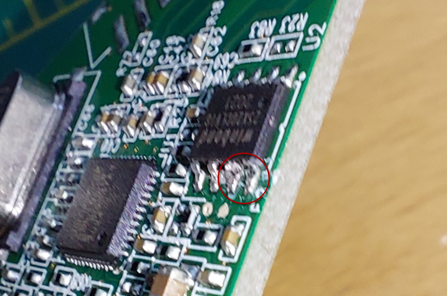
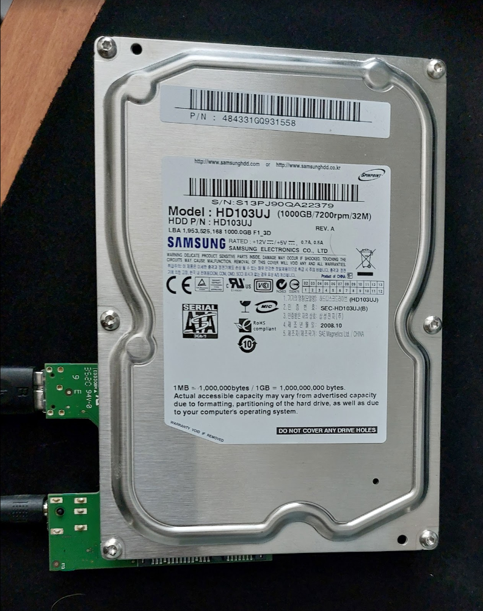
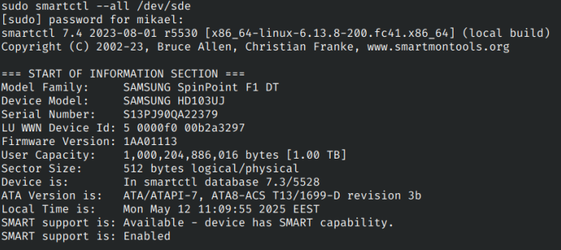
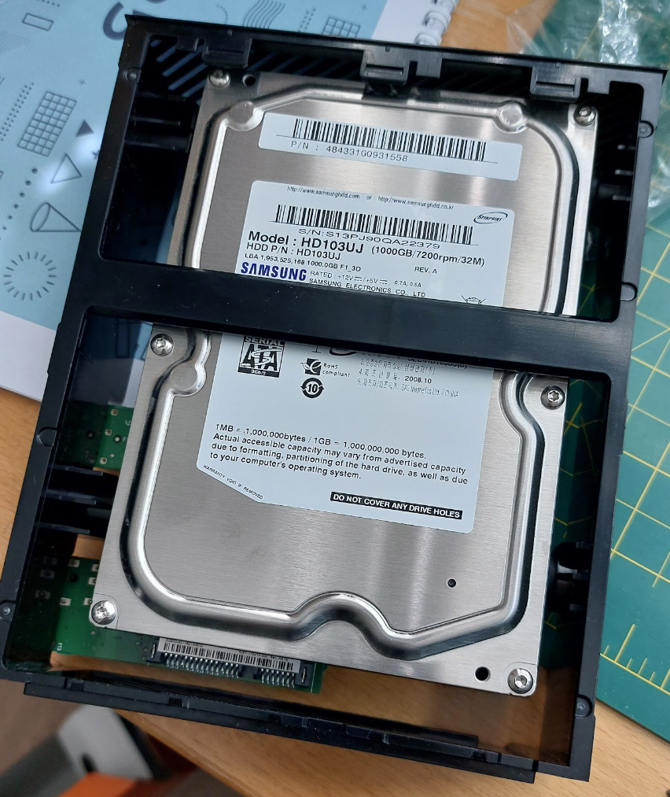

I came across to this Youtube video by [Mr Steve](https://www.youtube.com/watch?v=0qpdQQgWKvQ).  
Which showcased how to make existing WD MyBook enclosure to work with any SATA hard drive. I happened to have three existing ones.

The video states that this trick is going to work with `ASMedia ASM1151W` chip.  
Now I had one enclosure with this, but the other two used `JMicron JMS579` chip. 

Close up of the ASMedia ASM1151W chip:

Close up of the JMicron JMS579 chip:

Both controller boards next to each other - Asmedia left, Jmicron right:

After looking thru the interwebz I found that there were several suggested ways of doing this. 

Such as this [tool](https://www.reddit.com/r/DataHoarder/comments/p8s4cb/is_there_a_workaround_for_using_a_2021_wd_mybook/kji6yng/), and [this](https://www.reddit.com/r/DataHoarder/comments/p8s4cb/is_there_a_workaround_for_using_a_2021_wd_mybook/i4gkany/) way. 

In all of these methods you'd have to short some pins of the Winbond SPI, and then flash custom firmware to the chip.  
Results seemed varied.  
In this post I'm not gonna try doing this trick for the JMicron controller, but for the ASMedia.  
But I'm gonna keep those boards safe, so I can try it in the future when I have more time.

## Making it work

As outlined in the video earlier, the only thing you need to is cut the pins 1 and 2 of the Winbond SPI. You can do this by just breaking the legs of the chip. 

See following picture. I just used tweezers to cut them of. Picture quality is bad so apologies of that
.

After that I tested it by plugging it to some hard drive.  
I used the trusty Samsung Spinpoint F3, that has been running since 2010 (58705 hours) - and still works!

And look at that, it shows up!

Now we just pop this in to the tray, and we have succesfully saved the environment by reusing previously unusable stuff.

Hope this article is useful for others. Need to see about doing the trick for JMicron chips, so I can have some backup SATA-USB interfaces.