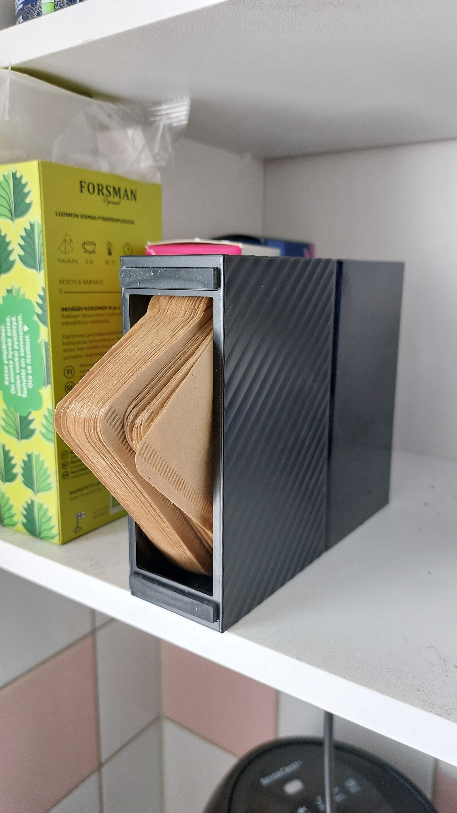

One of the most popular ways to get cheap HDD space is to buy external hard drives and "shuck" the drive out of them. The point is to do this shucking cleanly, so that if you have send it for warranty recall you can put it back in the enclosure.

Before doing the shuck be sure to run somekind of a stress test for few days so you know that it doesn't fail immediately. I used the `preclear` plugin in Unraid for this. 

To do this you need the enclousure, and thin plastic tools. Like guitar picks, credit cards. I used iFixit plastic picks. Plastic so that you don't damage the enclosure.

The process is quite simple. We need to put the plastic picks to seperate outer closure tabs from the inner closure.

1. There are five tabs at top. Three on the side where hard drive is closest to the enclosure. And two on the other side. Just wedge them in between, you will feel a pop. See the picture below.

2. Next is to start separating the inner enclosure from the outer enclosure. This is done from the bottom. You can use picks, some other thin plastic tool. The point here is to get the tabs at the bottom also separated. Just start doing this separation from one side and slide you plastic tool along in wedge. You will feel the tabs pop.

Once both edges are separated, you can just push the bottom in and the hard drive tray will just slide out.

The tabs on the top should look intact.
This drive is WD80EDAZ. Made in Thailan 2020-12-14.

Bonus: You can use the empty outer shell as a coffee filter holder! Or you can hack the Sata controller to support other drives. More of that in next post.

