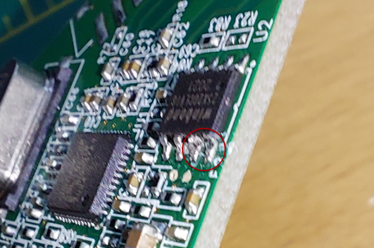
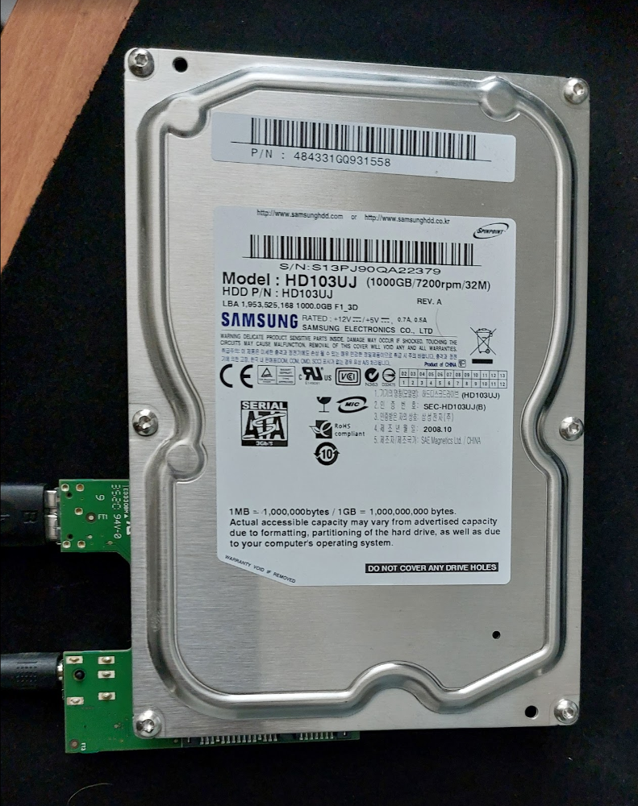

Törmäsin tähän mr[ Steven](https://www.youtube.com/watch?v=0qpdQQgWKvQ) YouTube-videoon, jossa esiteltiin, miten olemassa oleva WD MyBook -kotelo saadaan toimimaan minkä tahansa SATA-kiintolevyn kanssa. Minullahan sattui olemaan kolme sellaista.

Videolla väitetään, että tämä kikka toimii `ASMedia ASM1151W` -piirin kanssa. Minulla oli yksi kotelo tällä, mutta kahdessa muussa käytettiin `JMicron JMS579` -piiriä.

Lähikuva ASMedia ASM1151W -piiristä:

Lähikuva JMicron JMS579 -piiristä:

Molemmat ohjainkortit vierekkäin - Asmedia vasemmalla, Jmicron oikealla:

Selattuani internetiä löysin useita ehdotuksia tämän tekemiseksi.

Kuten tämä [työkalu](https://www.reddit.com/r/DataHoarder/comments/p8s4cb/is_there_a_workaround_for_using_a_2021_wd_mybook/kji6yng/) ja [tämä](https://www.reddit.com/r/DataHoarder/comments/p8s4cb/is_there_a_workaround_for_using_a_2021_wd_mybook/i4gkany/) tapa.

Kaikissa näissä menetelmissä jouduit oikosulkemaan joitakin Winbond SPI:n nastoja ja sitten asentamaan flash- sirulle mukautetun laiteohjelmiston. Tulokset näyttivät vaihtelevilta.
Tässä postauksessa en aio kuitenkaan yrittää tehdä tätä kikkaa JMicron-ohjaimelle, vaan ASMedialle.

Mutta aion pitää nuo piirilevyt tallessa, jotta voin kokeilla sitä tulevaisuudessa, kun minulla on enemmän aikaa.

## Saadaan se toimimaan

Kuten aiemmassa videossa esitettiin, sinun tarvitsee vain katkaista Winbond SPI:n nastat 1 ja 2. Voit tehdä tämän yksinkertaisesti katkaisemalla sirun jalat.

Katso seuraavaa kuvaa. Leikkasin ne vain pinseteillä. Kuvanlaatu on huono, joten pahoittelut siitä. .

Sen jälkeen testasin sitä kytkemällä sen johonkin kiintolevyyn. Käytin luotettavaa Samsung Spinpoint F3:a, joka on ollut toiminnassa vuodesta 2010 (58 705 tuntia) - ja toimii edelleen!

Ja katsokaa, se näkyy!

Nyt vain laitamme tämän tarjottimelle ja olemme onnistuneet pelastamaan ympäristön käyttämällä uudelleen aiemmin käyttökelvotonta tavaraa.

Toivottavasti tästä artikkelista on hyötyä muille. Pitää selvittää, miten tämä temppu tehdään JMicron-siruille, jotta minulla olisi varalle SATA-USB-liitäntöjä.
