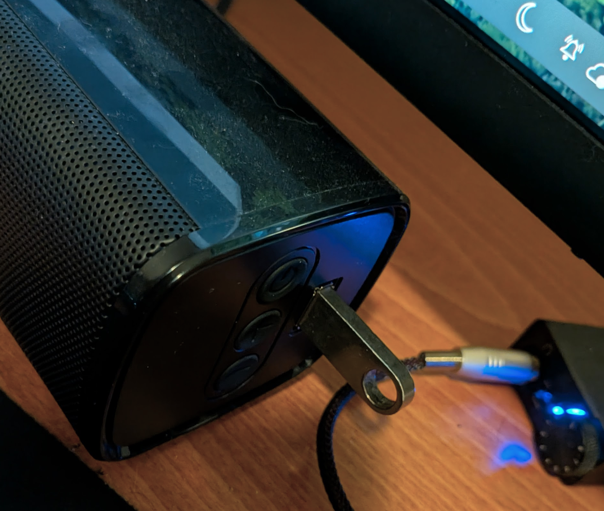
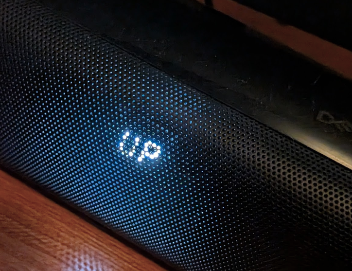
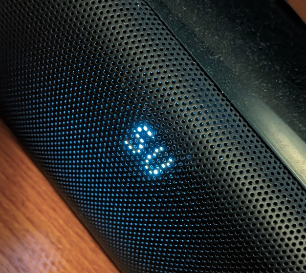

Edit: The firmware from Creative support page didnt actually fix the whole problem. See update below.

For a long time I have thought that the initial audio delay when playing video or audio had something do with my OS - Aurora Linux. Turns out it was problem with Cretive Stage v1 soundbar I have. This happens when there has been no audio playing for a while, notably when there is no silent "hiss" coming from the speaker.

Stumbled upon few Reddit [posts](https://www.reddit.com/r/Soundbars/comments/mau0wh/creative_stage_21_dropping_sound_at_specific/) and [video](https://www.youtube.com/watch?v=MdNxCXcltHA) about this. 
[Creative](https://support.creative.com/Products/ProductDetails.aspx?catID=4&subCatID=848&prodID=23279&prodName=Creative%20Stage&subCatName=Creative&CatName=) has made an official firmware fix for this already back in 2019. 

SHA256 checksum of the zip is `8b1e091937f752629a6e354abba452e717e186581a0c31a3152da0332e2d9113` 
And filename `MF8360 Creative Stage FW upgrader V01.zip`

Patch logs just states the ominious

> General improvements and bugs fixes

The guide is as follows. For it you need a "A thumbdrive with capacity below 32Gb (FAT 16/32)"

>     Download the file onto your local hard disk.
>     Copy the file into an empty thumbdrive.
>     Unzip downloaded file on your thumbdrive.
>     Ensure the speaker is Powered On.
>     Insert the thumbdrive into the speaker's USB A female port.
>     Display will show ‘UP’ indicating updating in progress
>     The update will be considered successful when the display changes to ‘SU’
>     Plug out socket from the mains and remove the thumbdrive
>     Plug in the speaker to the mains and power up the soundbar again.
>     Update complete.

So first prepare a USB drive and format it FAT32. And the copy the contents of aforementioned zip to it. Folder structure should look like this.

```plain
mikael at meso in media/mikael/565C-50B8 
✗  tree
.
└── system
    ├── upgrade_Dragon_SDK.bin
    └── upgrade.txt

2 directories, 2 files
```

Then plug in the USB drive to the USB-A port on the side.



Wait for the UP text, and the update process will start.This took less than a minute for me.



Then it shows SU meaning  the update is complete.



Now disconnect the power and after that remove USB drive. Power back up, and everything should work. No more annoying audio delay!

## Alternative firmware fix

The firmware provided by Creative supports page didn't fix the problem, but alleviated it a little bit. It seemed to keep the speaker alive longer, but the audio delay problem would start again after some time.
I uploaded the firmware here: 


I tried to flash the firmware mentioned in the Youtube [video](https://www.youtube.com/watch?v=MdNxCXcltHA) descrtion, and this seems to actually work.
But now I have discovered that my Creative Stage speaker has a very slight hiss sound constantly on. Will update this post for potential fix - if there is.
