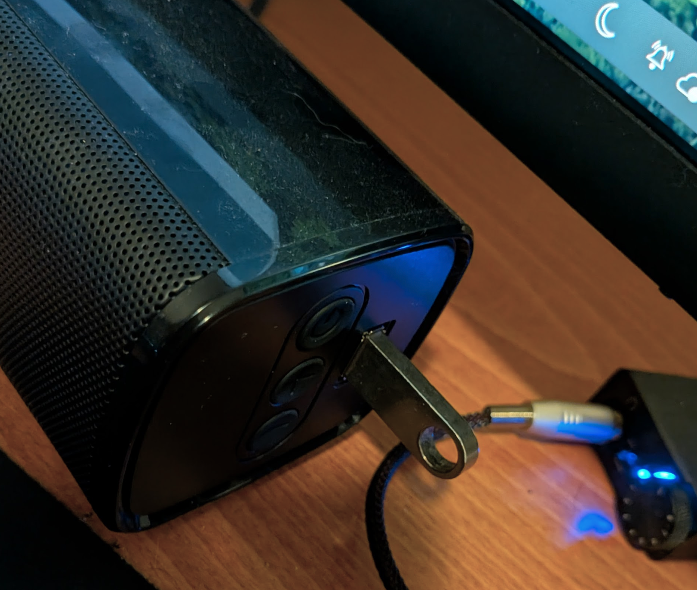
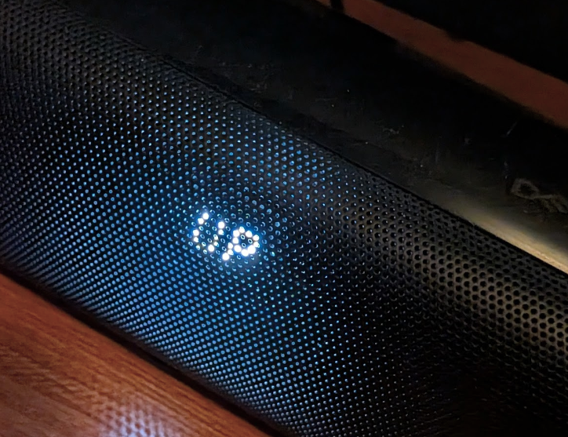

Olen pitkään luullut, että videon tai äänen toiston alussa ilmenevä viive johtui jotenkin käyttöjärjestelmästäni - Aurora Linuxista. Ongelma johtui kuitenkin Cretive Stage v1 -soundbaristani. Näin käy, kun ääntä ei ole toistettu vähään aikaan, etenkin jos kaiuttimesta ei kuulu hiljaista "sihinää".

Törmäsin muutamaan Reddit-julkaisuun ja videoon [^1][^2] tästä aiheesta.  Creative [^3] on tehnyt virallisen laiteohjelmistokorjauksen tälle jo vuonna 2019.

Zip-tiedoston SHA256-tarkistussumma on `8b1e091937f752629a6e354abba452e717e186581a0c31a3152da0332e2d9113` ja tiedostonimi `MF8360 Creative Stage FW upgrader V01.zip`

Päivitysloki on sisällöltään se perinteinen.

> General improvements and bugs fixes

Ohje on seuraavanlainen. Tarvitset muistitikun, jonka kapasiteetti on alle 32 Gt ja formaattina (FAT 16/32).

>     Download the file onto your local hard disk.
>     Copy the file into an empty thumbdrive.
>     Unzip downloaded file on your thumbdrive.
>     Ensure the speaker is Powered On.
>     Insert the thumbdrive into the speaker's USB A female port.
>     Display will show ‘UP’ indicating updating in progress
>     The update will be considered successful when the display changes to ‘SU’
>     Plug out socket from the mains and remove the thumbdrive
>     Plug in the speaker to the mains and power up the soundbar again.
>     Update complete.

Valmistele ensin USB-asema ja alusta se FAT32-muotoon. Kopioi sitten järjestelmän kansio juureen. Kansiorakenteen pitäisi näyttää tältä.

```plain
mikael at meso in media/mikael/565C-50B8
✗  tree
.
└── system
    ├── upgrade_Dragon_SDK.bin
    └── upgrade.txt

2 directories, 2 files
```



Odota UP-viestiä ja päivitys prosessi alkaa. Tämä kesti noin minuutin.



SU tarkoittaa että päivitystä on valmis.


Irrota  kaiuttimen virta ja vasta sen jälkeen USB-muistitikku. Kytke virta takaisin, niin kaiken pitäisi toimia. Ei enää ärsyttävää ääni viivettä!

## Vaihtoehtoinen firmware

Creativen tukisivun tarjoama laiteohjelmisto ei korjannut ongelmaa, ainoastaan lievensi sitä hieman. Tuo versio näytti pitävän kaiuttimen toiminnassa pidempään, mutta äänen viiveongelma alkoi uudelleen jonkin ajan kuluttua.

Tämä firmis löytyy [täältä](Stage%20Firmware%20from%20youtube.zip)

Kokeilin päivittää  kajareihin Youtube-videon [^4] kuvauksessa mainitun laiteohjelmiston, ja tämä versio näyttää itse asiassa toimivan.

 Mutta nyt olen huomannut, että Creative Stage -kaiuttimestani kuuluu jatkuvasti hyvin heikkoa sihinää. Päivitän tätä viestiä mahdollisen korjauksen varalta - jos sellainen on.

[^1]: https://www.reddit.com/r/Soundbars/comments/mau0wh/creative_stage_21_dropping_sound_at_specific/)
[^2]: https://www.youtube.com/watch?v=MdNxCXcltHA
[^3]: https://support.creative.com/Products/ProductDetails.aspx?catID=4&subCatID=848&prodID=23279&prodName=Creative%20Stage&subCatName=Creative&CatName=
[^4]: https://www.youtube.com/watch?v=MdNxCXcltHA
