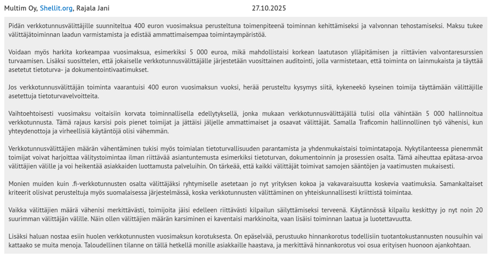

Viime kuukausina Traficom aiheutti pienen "kohun", kun liikenne- ja viestintäministeriö esitti että fi domainien hinta nousee 9€ -> 12€, ja verkkotunnusvälittäjille asetetaan 400€ vuosimaksu [^1].

Yksityisten ja yritysten antamat lausunnot olivat pääsääntöisesti tätä vastaan, mutta jotkut lausunnot olivat puoltavia ehdotuksen hyväksi. Näistä otti eniten silmään että puoltavat lasunnot oli isompien webhosting ja domain välitysfirmojen lausuntoja. Näiden lausuntojen tarkoitusperistä voi hyvinkin olettaa että halutaan savustaa pienemmät ja yksityiset tekijät pois pelikentältä, että "ammattimaiset" tekijät pystyvät takaamaan luotettavamman ja turvallisemman palvelun. Näin ainakin väitetään. Taustallaha on vain kilpailukentän kaventaminen, ja jos esim yksityisten käyttäjien välittäjästatuksesta tulee liian vaikeeta, niin nämä asiakkaat siirtyvät luonnollisesti isompien tarjoajien asiakkaiksi. Niinkuin esim tästä Shellit.org lausunnosta käy hyvinkin ilmi, joka hieman häkellyttää kuinka suorasti halutaan rajoittaa kilpailua, ja ajaa enemmän taalereita omaan laariin.

***

Oma domaini pitäis uusia vuoden alussa, ja tutkiessani että mitä kautta uusimisen voi halvinten tehdä, huomasin että hyvin tyypillinen strategia näillä isoilla tekijöillä on tarjota domain ensirekisteröinti halvalla ja veloittaa jossain tapauksissa yli kolminkertaiset summat uusimisesta. Esimerkiksi yllämainitun Shellit.org tapauksessa normaalintahinta rekisteröimiselle on 21,50€/vuosi, mutta uusimisen hintaa en löytänyt heidän sivuiltaan.

Palautteesta johtuen  liikenne- ja viestintäministeriö poisti verkkotunnusvälittäjä muutoksen asetuksesta, ja aikoo arvioidan asian uudelleen. [^3]

> Asetusluonnoksessa ehdotettu uusi verkkotunnusvälittäjän vuosimaksu (400 euroa) poistetaan asetuksen 2§:stä kokonaan säädösperustan uudelleen arvioinnin johdosta.

Mielenkiintoisesti Shellit.org huomasi markkinaraon ja alkoi alustavasti tarjoamaan verkkotunnusvälittäjälle jälleenmyyjä alustaa pienellä lisähinnalla. Nerokasta! [^4]

***

Tästä viisastuneena ja fi domainien uusimishintojen johdosta päätin itse rekisteröityä Traficomille verkkotunnuksenvälittäjäksi ja katkaista välikädet. Prosessi kun on hyvin yksinkertainen. En ymmärrä miksi en ollut aikaisemmin tehnyt tätä, varmaan olen olettanut että kyseessä olisi hirveä määrä byrokratiaa.

Täytät vain Traficomin sivuilla olevan hakemuslomakkeen [^5]. Itse täytin yksityishenkilön roolissa, ja merkitsin että tarjoamani palvelu on `Verkkotunnusten hallinnointi ilman muita palveluita`

Noin viikon kuluttua sain sähköpostia että uusien NIS2 vaatimusten johdosta minun piti täyttää Kybermittari itsearvointi Excel-taulukko, joka vaikutti alussa hieman haastavalta. Tämän Kybermittarin kysymykset oli tarkoitettu enemmän yrityksille kuin yksityisille verkkotunnusvälittäjille. Vastasin tähän kuitenkin rehellisesti ja oman tietoteknisen laitteiston näkökulmasta.

Seuraavana päivänä sain Traficomilta rekisteröitymislinkin hallintapalveluun ja omaksi yllätykseksi näkymä ei oikein eronnut mitenkään muiden domain tarjoajien vastaavasta. Kysymys kuuluukin, että miksi Traficomin pitää tehdä tämmöinen välivaihe yksityisille, sen sijaan että he tarjoasivat fi domainien rekisteröimisen ilman DNS -palvelimia suoraan.

Kannattaa muuten tehdä tämä hakemus ennen 16.1.2026, jolloin tuo domainien hinta kasvaa. Itse rekisteröin suoraan 5vuodeksi kerralla 54€ hintaan.

[^1]: https://www.lausuntopalvelu.fi/FI/Proposal/Participation?proposalId=bb3cd297-6c3b-456e-b647-e434208148ef

[^2]: https://old.reddit.com/r/Suomi/comments/1pt1g8b/traficom_luopuu_esitetyst%C3%A4_fi/

[^3]: https://valtioneuvosto.fi/paatokset/paatos?decisionId=5370

[^4]: https://www.shellit.org/verkkotunnusten-valitys-uudistuu/

[^5]: https://traficom.fi/fi/viestinta/fi-verkkotunnukset/verkkotunnusvalittajalle/fi-verkkotunnusvalittajaksi-ilmoittautuminen
