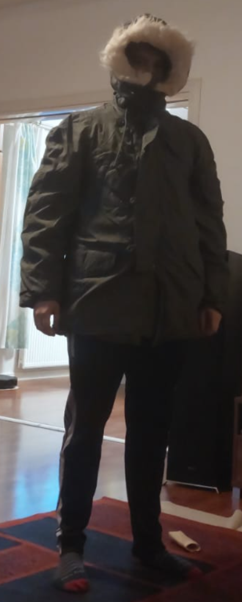
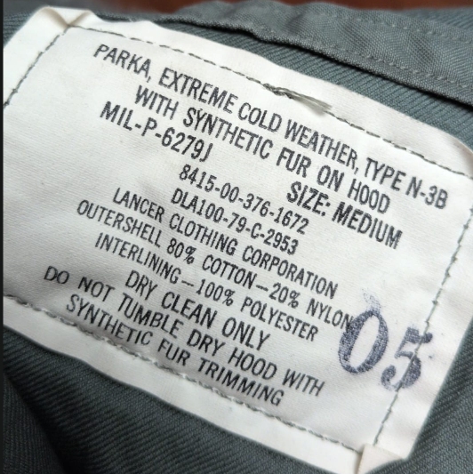

Bongasin Kohka.fi -verkkokaupasta[^1] suhteellisen halutun USAF N-3B Parka takin, joita ei ainakaan suomalaisissa ylijäämäkaupoissa kovin usein ole tultu nähtyä. Ostin takin pienen mietinnän jälkeen, koska miksi ostaisin talvitakin kesän kynnyksellä? Testaamaan sitä en pääsisi, ja varmaan tulen ostamaan muitakin talvitakkeja pitkin vuotta. Noh, kuka tietää mutta M koon takki tuli postissa ja ensi vaikutelma "Eau De Ylijäämä" hajun lisäksi oli kuinka painava takki on.

N-3B parkoihin olen aikaisemmin päässyt tutustumaan vain Alpha Industriesin repro takkien puolelta, ja näihin verrattuna tämä aito on huomattavasti jykevämpi ja vähän karumpi. Perus armeijatyyliä siis.

Mukana myös mysteerinen "Inspected by #2" lappu.

Oma takkini on tehty vuonna 1976 Lancer Corporationin toimesta. Tiettävästi tämä on juuri se versio missä siirrytiin kokonaan keinokuituihin sisälmyksien osalta ja ulkopuoli oli joko nylon-puuvilla sekoitetta tai sitten 100% puuvillaa [^2].

Harmillisesti en löytänyt oman version MIL-P dokumenttia, mutta esim vuoden 1993 \`MIL-P-6279L\` speksi löytyi [^3].
Tosin eipä näissä dokumenteista selviä juurisyyt materiaalivalinnoille. Ironsnailin videossa argumentoitiin, että paremman nylon ja puuvillan blendin takia  päälymateriaali pystyi kuivumaan nopeammin, ja sen takia pystyttiin vaihtamaan villasta paksumaan polyesteri toppaukseen. Jonka johdosta myös takin paino tippui silti säilyttäen samat ominaisuudet kuivumisen ja lämmön osalta kuin 50-60 luvun villaversiossa [^4].

Takin todellinen testaus -30c pakkasissa kuitenkin saa odottaa talvelle, jolloin voisin kirjoittaa lisänootin tähän juttuun. Virallisesti takki on speksattu -50c pakkasiin. Uskon kumminkin että tämä parka toimii noissa lämpötiloissa paremmin kuin aikaisemmin käyttämäni Tsekin armeijan M85 parka vuodelta 1988.

[^1]: https://kohka.fi/products/usaf-n-3b-parka-ylijaama
[^2]: https://www.thefedoralounge.com/threads/can-someone-help-me-to-date-this-vintage-n3b-parka.79736/#post-1871774
[^3]: https://everyspec.com/MIL-SPECS/MIL-SPECS-MIL-P/MIL-P-6279L_39242/
[^4]: https://www.youtube.com/watch?v=oaSvuR-x-Ug
