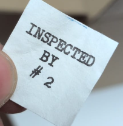

Bongasin Kohka.fi -verkkokaupasta[^1] suhteellisen halutun USAF N-3B Parka takin, joita ei ainakaan suomalaisissa ylijäämäkaupoissa kovin usein ole tultu nähtyä. Ostin takin pienen mietinnän jälkeen, koska miksi ostaisin talvitakin kesän kynnyksellä? Testaamaan sitä en pääsisi, ja varmaan tulen ostamaan muitakin talvitakkeja pitkin vuotta. Noh, kuka tietää mutta M koon takki tuli postissa ja ensi vaikutelma "Eau De Ylijäämä" haun lisäksi oli kuinka painava takki on.

Oma takkini on tehty vuonna 1976 Lancer Corporationin toimesta. Tiettävästi tämä on juuri se versio missä siirryttini kokonaan keinokuituihin sisälmyksien osalta ja ulkopuoli oli joko nylon-puuvilla sekoitetta tai sitten 100% puuvillaa [^2]

[^1]: https://kohka.fi/products/usaf-n-3b-parka-ylijaama
[^2]: https://www.thefedoralounge.com/threads/can-someone-help-me-to-date-this-vintage-n3b-parka.79736/#post-1871774
